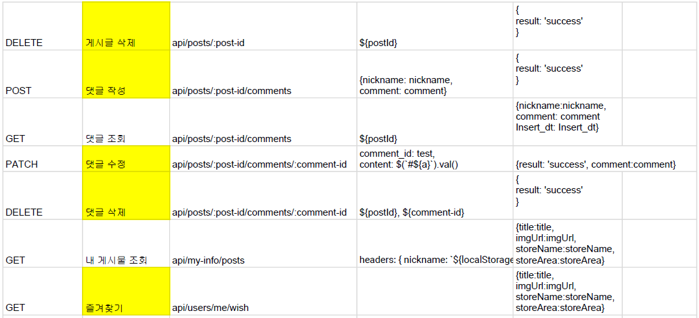

# 항해 4주차 미니프로젝트2

# 해피텅!

### 음식은 두가지로 나뉜다. 내가 먹어본 것, 내가 앞으로 먹어볼 것. 맛집추천과 맛집 찾기를 동시에!😋

# 팀원

Backend

신성웅

허선희

오정민

Frontend

김세연

김현수

김한준

# 와이어프레임

Figma를 이용해 와이어프레임을 설계했습니다!

[https://www.figma.com/file/uUDubcptUhos77TzoODvyP/Untitled?node-id=0%3A1](https://www.figma.com/file/uUDubcptUhos77TzoODvyP/Untitled?node-id=0%3A1)

# API 설계

**user**

POST /api/users/auth

DELETE /api/users/auth

POST /api/users/signup

GET /api/users/me

**posts**

GET /api/posts

POST /api/posts

GET /api/posts/search/:keyword

DELETE /api/posts/:post-id

PATCH /api/posts/:post-id

**comment - controller**

GET /api/posts/:post-id/comments

POST /api/posts/:post-id/comments

DELETE /api/posts/:post-id/comments/:comment-id

PATCH /api/posts/:post-id/comments/:comment-id

## 깃허브 주소

프론트엔드

[https://github.com/geemhunsu/happyTongue-FrontEnd](https://github.com/geemhunsu/happyTongue-FrontEnd)

백엔드

[https://github.com/shinsw627/happyTongue-Back](https://github.com/shinsw627/happyTongue-Back)

